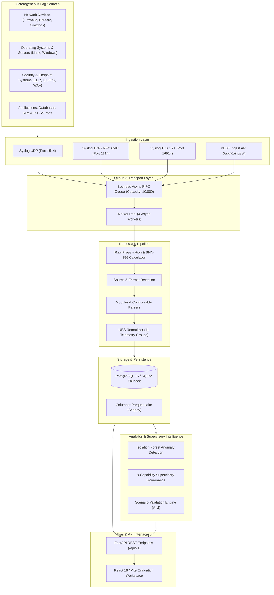
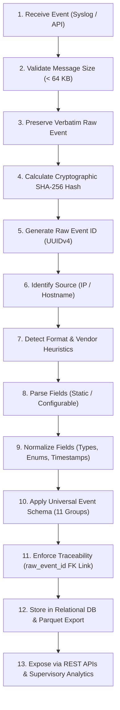
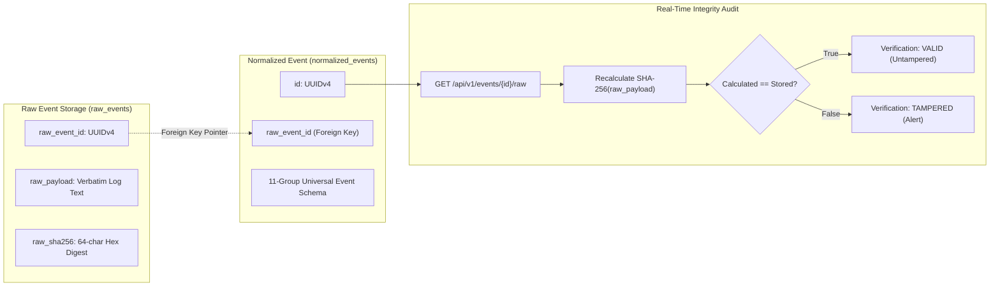
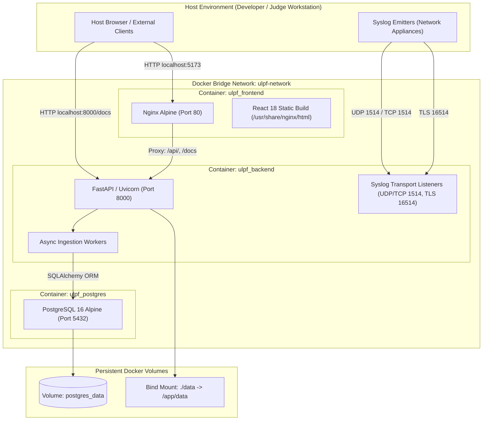

# ULPF — System Architecture

**Project:** Universal Log Pre-processing Framework (ULPF)  
**Smart India Hackathon 2026** | **Problem Statement:** `SIH26156`  
**Organization:** National Technical Research Organisation (NTRO)  
**Theme:** Blockchain & Cybersecurity  

---

## 1. Overview

The **Universal Log Pre-processing Framework (ULPF)** is an open, vendor-agnostic, scalable log pre-processing and supervisory intelligence framework. It is engineered to ingest high-velocity logs and events from heterogeneous infrastructure, preserve original log context verbatim, automatically identify sources and formats, normalize data into a canonical unified schema, maintain cryptographic and relational traceability, and provide clean, structured data for downstream security monitoring, forensic investigations, statistical analytics, and SIEM/data-lake integration.

The system architecture is specifically designed around core defense and enterprise operational requirements:
- **Heterogeneous Log Sources:** Seamless ingestion of varying log syntax across perimeter security appliances, network switches, operating systems, servers, applications, databases, identity systems, and IoT assets.
- **On-Premise Deployment:** Platform-independent architecture designed to execute within private data centers and enterprise perimeter environments.
- **Air-Gapped Environments:** 100% self-contained runtime operation with zero dependency on external cloud APIs, cloud LLMs, internet access, or outbound telemetry egress.
- **Security & Forensic Traceability:** Bit-for-bit raw log preservation with cryptographic SHA-256 integrity verification, ensuring forensic admissibility and tamper evidence.
- **Scalable Ingestion:** Non-blocking asynchronous network transport, bounded queue management with backpressure control, and concurrent multi-worker processing.
- **Extensibility:** Decoupled modular parser interfaces and an intelligent no-code onboarding engine for integrating new or proprietary vendor formats without rewriting core application code.

---

## 2. High-Level Architecture

The framework operates as an end-to-end decoupled pipeline:



### Heterogeneous Source Support
ULPF ingests telemetry across all major enterprise infrastructure tiers:
- **Network Devices:** NGFWs, perimeter edge routers, aggregation switches, VPN gateways, load balancers.
- **Servers & Operating Systems:** Linux kernel/systemd events, Windows Security Event logs, Unix daemon facilities.
- **Applications & Web Tiers:** Nginx access/error logs, Apache HTTPD, microservice application events.
- **Databases:** Relational and NoSQL connection, query, and audit logs.
- **Cloud & Container Environments:** Kubernetes container stdout/stderr streams, edge ingress controllers.
- **Endpoint & Security Systems:** EDR sensor reports, IDS/IPS alerts, WAF denial records.
- **Identity & Access Management (IAM):** Active Directory authentication logs, Kerberos, RADIUS, SSO gateways.
- **IoT & Embedded Sources:** Industrial sensors, smart infrastructure devices, legacy gateway emitters.

---

## 3. Component Architecture

### 3.1 Frontend
- **Framework:** React 18 with TypeScript, compiled via Vite.
- **Styling:** Vanilla CSS with custom Tailwind CSS utility tokens implementing a dark cybersecurity theme.
- **Key Modules & Pages:**
  - **SIH Demonstration Workspace (`/demo`):** 1-Click interactive pipeline runner with automated Scenarios A through J validation breakdown.
  - **Dashboard (`/dashboard`):** System health status, ingestion throughput, and component readiness monitoring.
  - **Events Explorer (`/events`):** Interactive Universal Event Schema table with real-time cryptographic SHA-256 recalculation and raw log inspection.
  - **Live Ingestion (`/ingest`):** Single and batch log testing console with real-time format detection preview.
  - **No-Code Onboarding (`/onboarding`):** Interactive structural analyzer, type inference assistant, field mapping editor, and profile management.
  - **Security Analytics (`/security-analytics`):** Isolation Forest anomaly breakdown, source health radar, and contextual alert prioritization.
  - **Supervisory Assessment (`/supervisory`):** 8-capability dimension evaluation, peer benchmarking, and 6-level forensic evidence chain drill-downs.
- **API Client:** Type-safe fetch client (`frontend/src/services/api.ts`) communicating over relative paths, proxied through Vite in development and Nginx in production.

### 3.2 Backend
- **Framework:** FastAPI running on Python 3.12+ ASGI server (`uvicorn`).
- **Data Validation:** Pydantic v2 schemas for request validation and immutable event representations.
- **Relational Persistence:** SQLAlchemy 2.0 ORM with Alembic schema migration management.
- **Core Services:**
  - `IngestionService`: Ingestion coordinator and format classifier.
  - `NormalizationService`: Field transformer and UES schema mapper.
  - `SyslogManager`: Lifecycle coordinator for UDP, TCP, and TLS socket listeners and background worker pools.
  - `OnboardingService`: Deterministic structure analyzer and dynamic mapping profile manager.
  - `ParquetExporter`: Columnar dataset export engine with Snappy compression.
  - `AnomalyService`: Unsupervised machine learning (`IsolationForest`) running on numerical feature matrices.
  - `SupervisoryService`: Multi-entity governance engine calculating 8 capability scores and forensic evidence chains.
  - `ValidationEngine`: Deterministic evaluator for operational scenarios (Scenarios A through J).

### 3.3 Ingestion Engine
- **Syslog UDP Listener (`udp_listener.py`):** Asynchronous datagram socket listener bound to UDP port `1514` (configurable via `SYSLOG_UDP_PORT`). Rejects packets exceeding `SYSLOG_MAX_MESSAGE_BYTES=65536` (64 KB).
- **Syslog TCP Listener (`tcp_listener.py`):** Asynchronous streaming socket listener bound to TCP port `1514` (configurable via `SYSLOG_TCP_PORT`). Supports both newline-delimited framing and RFC 6587 octet-counted framing (`<length> <message>`). Enforces `SYSLOG_TCP_CONNECTION_LIMIT=100` and idle timeouts (`SYSLOG_TCP_IDLE_TIMEOUT_SECONDS=60`).
- **Syslog TLS Listener (`tls_listener.py`):** Encrypted streaming socket listener bound to TCP port `16514` (configurable via `SYSLOG_TLS_PORT`), supporting TLS 1.2+ server-side certificates.
- **Port Mapping Notice:** Ports `1514` (UDP/TCP) and `16514` (TLS) are default non-privileged development ports. When deploying to production environments, standard Syslog ports (`514/udp`, `514/tcp`, `6514/tcp`) can be mapped externally at the firewall or Docker host level.
- **Bounded Queue & Worker Model:** Incoming messages are placed into an in-memory `asyncio.Queue` bounded to `SYSLOG_QUEUE_MAXSIZE=10000`. A pool of `SYSLOG_WORKERS=4` concurrent asynchronous tasks consumes items from the queue. If queue capacity is saturated during extreme traffic bursts, backpressure protection increments `dropped_packets` metrics to protect process memory.

### 3.4 Processing Pipeline



The 13-step processing sequence executes deterministically for every event:
1. **Receive Event:** Packet arrives via UDP, TCP, TLS socket, or HTTP POST payload.
2. **Validate Message:** Confirms size does not exceed bounded limit (64 KB).
3. **Preserve Raw Event:** Captures the verbatim raw string without modifying spacing or content.
4. **Calculate SHA-256 Hash:** Computes `raw_sha256 = hashlib.sha256(raw_bytes).hexdigest()`.
5. **Generate Raw Event Identity:** Assigns a persistent UUID primary key (`raw_event_id`).
6. **Identify Source:** Resolves sender IP address or hostname against registered `log_sources`.
7. **Detect Format & Vendor:** Evaluates regex and envelope patterns to classify format and vendor with confidence scores.
8. **Parse Fields:** Dispatches payload to the corresponding parser plugin or dynamic `ConfigurableParser`.
9. **Normalize Fields:** Standardizes IP addresses, ports, timestamps to UTC ISO 8601, and categorical enums (`action`, `severity`).
10. **Apply Universal Event Schema:** Validates normalized data into the canonical 11-group schema.
11. **Maintain Traceability:** Injects non-nullable `raw_event_id` foreign key referencing the originating raw event record.
12. **Store / Process Event:** Commits raw and normalized records into the relational database and queues for Parquet export.
13. **Expose Event:** Surfaces data through REST APIs, UI search explorers, anomaly detectors, and supervisory assessment engines.

---

## 4. Supported Formats

| Format | Standards / Specifications | Typical Sources | Parser Implementation |
|---|---|---|---|
| **RFC 3164 Syslog** | BSD Syslog protocol (`<PRI>TIMESTAMP HOSTNAME TAG: MSG`) | Legacy routers, Linux daemons | `SyslogParser` |
| **RFC 5424 Syslog** | Structured Syslog protocol (`<PRI>VERSION TIMESTAMP HOSTNAME APP PROCID MSGID STRUCTURED-DATA MSG`) | Modern perimeter firewalls, switches | `SyslogParser` |
| **JSON** | Hierarchical / Flat JSON text | Cloudflare, AWS CloudWatch, WAFs, microservices | `JsonParser` |
| **CEF** | ArcSight Common Event Format (`CEF:Version\|Device Vendor\|Device Product\|...`) | Check Point, Cisco FTD, Imperva | `CefParser` |
| **LEEF** | IBM Log Event Extended Format (`LEEF:Version\|Vendor\|Product\|...`) | IBM QRadar network sensors | `LeefParser` |
| **CSV** | Comma-separated variable schemas | Palo Alto PAN-OS traffic & threat logs | `CsvParser` |
| **Key-Value** | Delimited parameter pairs (`key1=val1 key2="val 2"`) | Fortinet FortiOS UTM logs | `SyslogParser` / `ConfigurableParser` |
| **Safe XML** | XML telemetry payloads with strict entity resolution disabling | Perimeter appliances, Windows Event Forwarding | `XmlParser` (XXE protected) |
| **Unknown / Custom** | Previously unclassified custom or proprietary formats | Bespoke enterprise appliances | `ConfigurableParser` |

### Graceful Handling of Unknown Formats
When an incoming event fails to match known format signatures:
1. The verbatim payload is safely ingested and stored in `raw_events` with format marked as `unknown`.
2. A fallback normalized event is generated containing standard envelope metadata (received timestamp, source IP, raw event reference) with the unparsed text preserved in `message`.
3. The event is tagged with `validation_status="UNKNOWN_FORMAT"` and flagged for the No-Code Onboarding Engine.
4. Ingestion pipelines and network listeners continue operating without exceptions, dropped socket buffers, or data loss.

---

## 5. Vendor Handling

| Vendor | Primary Products | Ingested Formats | Field Normalization Focus |
|---|---|---|---|
| **Cisco** | Cisco ASA 5500, Secure Firewall (FTD) | RFC 3164, RFC 5424, CEF | Tag parsing (`%ASA-6-302013`), TCP/UDP connection teardown codes, ACL hit rules |
| **Fortinet** | FortiGate NGFW, FortiOS UTM | Key-Value Syslog | `srcip`, `dstip`, `action`, `subtype`, `devname`, policy IDs |
| **Palo Alto** | PAN-OS NGFW | CSV Syslog | `TRAFFIC` and `THREAT` event types, ingress/egress zones, NAT translated IPs |
| **Check Point** | Quantum Security Gateway | CEF, RFC 5424 | Action mappings (`drop`, `accept`, `reject`), attack names, rule numbers |
| **Generic / Unknown**| Custom servers, switches, microservices | Delimited, JSON, Syslog | Heuristic extraction of 5-tuple networking fields via `ConfigurableParser` |

### Pipeline Vendor Resolution
1. **Source Registry Lookup:** The incoming socket IP or hostname is matched against registered `log_sources`. If pre-registered, the vendor profile is established immediately.
2. **Payload Fingerprinting:** If unregistered, the format detection engine inspects characteristic vendor tokens (`%ASA-`, `devname=`, `PAN-OS`, `CEF:0|Check Point`) to infer vendor and product.
3. **Adaptive Parser Selection:** Parsers apply vendor-specific attribute dictionaries, mapping proprietary field names (e.g. Fortinet `srcip` or Cisco `src_ip`) into canonical UES fields (`source_ip`).

---

## 6. Unified Event Schema (UES)

The Universal Event Schema standardizes diverse perimeter telemetry into 11 canonical logical groups:

```text
┌────────────────────────────────────────────────────────────────────────┐
│                     UNIVERSAL EVENT SCHEMA (UES)                       │
├────────────────────────────────────────────────────────────────────────┤
│ 1. Identity         │ event_id (UUIDv4), source_event_id,              │
│                     │ schema_version                                   │
│ 2. Time             │ timestamp, ingestion_timestamp (UTC), timezone   │
│ 3. Source Device    │ vendor, product, device_type, device_id,         │
│                     │ hostname, source_format                          │
│ 4. Network          │ source_ip, source_port, destination_ip,          │
│                     │ destination_port, protocol                       │
│ 5. User Identity    │ username, user_id, authentication_method         │
│ 6. Event Taxonomy   │ event_type, action (allow/block/drop/alert),     │
│                     │ outcome, severity (Critical/High/Med/Low/Info),  │
│                     │ category                                         │
│ 7. Network Context  │ interface, direction (inbound/outbound), zone    │
│ 8. Threat & Security│ threat_name, threat_id, signature_id, rule_id    │
│ 9. Extensibility    │ message, tags, custom_fields (JSON dictionary)   │
│ 10. Traceability    │ raw_event_id (FK), parser_id, parser_version,    │
│                     │ normalization_version                            │
│ 11. Raw Preservation│ raw_event (verbatim original string)             │
└────────────────────────────────────────────────────────────────────────┘
```

### Core Architectural Axiom
$$\text{RAW EVENT} + \text{NORMALIZED EVENT} + \text{TRACEABILITY} = \text{TRUSTED AUDIT TRAIL}$$

Normalization never mutates, truncates, or overwrites original logs. Every normalized record maintains an unbreakable foreign key link back to the exact byte-sequence from which it was extracted.

---

## 7. Raw Event Preservation & Traceability



### Forensic and Compliance Guarantees
1. **Verbatim Preservation:** Captured payloads are stored completely unstripped in `raw_events.raw_payload`.
2. **Cryptographic SHA-256 Hashing:** A SHA-256 digest is calculated at the exact moment of ingestion and stored alongside the raw record (`raw_events.raw_sha256`).
3. **Foreign Key Integrity:** `normalized_events.raw_event_id` enforces a non-nullable foreign key constraint linking back to `raw_events.id`.
4. **On-Demand Audit Recalculation:** When retrieving an event through the API (`GET /api/v1/events/{id}/raw`), the system dynamically recomputes the SHA-256 digest over the raw payload and compares it to `raw_sha256`. If a single character was altered, the check fails immediately.
5. **Legal & Compliance Admissibility:** Meets stringent chain-of-custody standards for digital forensics and defense regulatory audits.

---

## 8. Queue and Reliability Architecture

The ingestion transport utilizes an asynchronous producer-consumer architecture designed to withstand high-volume bursts:

```text
External Sockets (UDP 1514 / TCP 1514 / TLS 16514)
                   │
                   ▼
┌────────────────────────────────────────────────────────┐
│ Bounded Async FIFO Queue (`asyncio.Queue`)             │
│ - Capacity: 10,000 messages (`SYSLOG_QUEUE_MAXSIZE`)   │
│ - Message Size Limit: 64 KB (`SYSLOG_MAX_MESSAGE_BYTES`)│
│ - Connection Limit: 100 concurrent streams            │
└──────────────────────────┬─────────────────────────────┘
                           │
        ┌──────────────────┼──────────────────┐
        ▼                  ▼                  ▼
┌──────────────┐   ┌──────────────┐   ┌──────────────┐
│ Worker 1     │   │ Worker 2     │   │ Worker 3 & 4 │
│ (Ingest &    │   │ (Ingest &    │   │ (Ingest &    │
│  Normalize)  │   │  Normalize)  │   │  Normalize)  │
└───────┬──────┘   └───────┬──────┘   └───────┬──────┘
        └──────────────────┼──────────────────┘
                           ▼
               Database & Parquet Storage
```

### Verified Configuration Constants
- **`SYSLOG_QUEUE_MAXSIZE`:** `10000` messages.
- **`SYSLOG_WORKERS`:** `4` concurrent worker tasks.
- **`SYSLOG_MAX_MESSAGE_BYTES`:** `65536` bytes (64 KB). Packets exceeding this size are rejected to prevent buffer bloat.
- **`SYSLOG_TCP_CONNECTION_LIMIT`:** `100` concurrent TCP connections.
- **`SYSLOG_TCP_IDLE_TIMEOUT_SECONDS`:** `60` seconds. Inactive socket descriptors are recycled automatically.
- **Backpressure Protection:** When the queue reaches capacity, the producer drops incoming packets and increments the internal `dropped_packets` metric rather than exhausting system RAM.

---

## 9. Supervisory Intelligence

The supervisory intelligence engine operates 100% offline directly over normalized telemetry, providing governance across Critical Sector Entities (CSEs):

### 9.1 The 8 Capability Dimensions
Every monitored entity is evaluated against 8 operational dimensions:
1. **Alert Hygiene:** Proportion of alert triage actions with comprehensive investigation notes.
2. **Investigation Rigor:** Average investigation duration and case closure depth.
3. **Escalation Responsiveness:** Presence of escalation evidence for high and critical severity alerts.
4. **Log Source Availability:** Health and uptime status of registered perimeter log sources.
5. **Telemetry Completeness:** Absence of negative-space coverage gaps across essential monitoring categories.
6. **Peer Alignment:** Statistical behavioral alignment against regional and sector peer entities.
7. **Investigation Diversity:** Absence of automated or scripted template-like alert closure patterns.
8. **Volume Stability:** Absence of unexplained anomalous event volume spikes or drops.

### 9.2 Contextual Alert Prioritization
Alerts are dynamically prioritized into four actionable tiers based on severity, asset criticality, repeated occurrences, and investigation velocity:
- **Priority 1 (Critical):** Immediate supervisory review required (e.g. unescalated critical threat or rapid case closure).
- **Priority 2 (High):** Repeated alerts without remediation or abnormal peer deviations.
- **Priority 3 (Medium):** Minor configuration warnings or telemetry category gaps.
- **Routine:** Standard operational log activity.

### 9.3 Epistemic Data Quality Standards
The supervisory engine maintains strict philosophical distinctions in its evaluations:
- **No Evidence:** Telemetry was collected and analyzed, and no indicators were present.
- **Evidence of Absence:** Explicit controls confirmed that an activity did not occur.
- **Insufficient Data:** Insufficient telemetry was ingested to form an empirical conclusion.

> **Supervisory Safeguard:** Missing telemetry is **never** interpreted as proof of security or compliance.

---

## 10. Evaluation Architecture

ULPF incorporates a dedicated SIH Demonstration & Evaluation Engine (`backend/app/services/validation/engine.py` and `tools/run_evaluation.py`) that evaluates 10 operational and supervisory scenarios deterministically:

| Scenario | Title | Target Entity | Expected Analytical Indicator | Validation Status |
|---|---|---|---|---|
| **Scenario_A** | Rapid Case Closure | `CSE-ALPHA-01` | `FAST_CASE_CLOSURE_WITHOUT_INVESTIGATION` | **PASS (100% Precision)** |
| **Scenario_B** | Repeated Unmitigated Alerts | `CSE-BETA-02` | `REPEATED_ALERTS_WITHOUT_REMEDIATION` | **PASS (100% Precision)** |
| **Scenario_C** | Unescalated Critical Events | `CSE-GAMMA-03` | `CRITICAL_EVENT_LACKS_ESCALATION_EVIDENCE` | **PASS (100% Precision)** |
| **Scenario_D** | Silent Log Source | `CSE-EPSILON-05` | `SILENT_LOG_SOURCE` | **PASS (100% Precision)** |
| **Scenario_E** | Missing Telemetry Category | `CSE-DELTA-04` | `MISSING_EVENT_CATEGORY` | **PASS (100% Precision)** |
| **Scenario_F** | Peer Activity Deviation | `CSE-GAMMA-03` | `PEER_ACTIVITY_DEVIATION` | **PASS (100% Precision)** |
| **Scenario_G** | Template Investigation Pattern| `CSE-ALPHA-01` | `TEMPLATE_INVESTIGATION_PATTERN` | **PASS (100% Precision)** |
| **Scenario_H** | Abnormal Volume Spike | `CSE-BETA-02` | `VOLUME_SPIKE` | **PASS (100% Precision)** |
| **Scenario_I** | Abnormal Volume Drop | `CSE-EPSILON-05` | `VOLUME_DROP` | **PASS (100% Precision)** |
| **Scenario_J** | Unknown Format Onboarding | `CSE-ALPHA-01` | `UNKNOWN_VENDOR_FORMAT` | **PASS (100% Precision)** |

### Synthetic Ground Truth
All evaluation scenarios are driven by clean, reproducible synthetic datasets (`data/synthetic/` and `DemoDatasetGenerator`). Zero production or classified operational records are contained in the repository.

---

## 11. API Architecture

The FastAPI backend exposes modular REST API routers under `/api/v1`:

### 11.1 System Health & Readiness
- `GET /api/v1/health`: Overall health and readiness audit across API, Database, Parser Registry, Ingestion, Analytics, Anomaly Engine, and Supervisory Engine.

### 11.2 Live Syslog Transport Control
- `GET /api/v1/syslog/status`: Real-time listener status (UDP, TCP, TLS), active connections, queue depth, and throughput metrics.
- `POST /api/v1/syslog/start`: Administratively starts background listeners and worker pool.
- `POST /api/v1/syslog/stop`: Gracefully terminates background listeners and drains worker queues.
- `POST /api/v1/syslog/metrics/reset`: Resets operational counters and throughput metrics for benchmark runs.

### 11.3 Ingestion & Detection
- `POST /api/v1/ingest`: Ingests and normalizes a single raw log payload.
- `POST /api/v1/ingest/batch`: Ingests and processes a batch of raw log strings.
- `POST /api/v1/detect-format`: Analyzes a raw payload and returns detected format, confidence score, and rationale.

### 11.4 Universal Events & Traceability
- `GET /api/v1/events`: Paginated query interface with filtering by vendor, severity, event type, and date ranges.
- `GET /api/v1/events/{id}`: Retrieves complete 11-group normalized event.
- `GET /api/v1/events/{id}/raw`: Retrieves verbatim raw event and executes real-time cryptographic SHA-256 verification.

### 11.5 No-Code Log Onboarding
- `POST /api/v1/onboarding/analyze`: Performs structural analysis and delimiter detection on sample logs.
- `POST /api/v1/onboarding/suggest-mappings`: Generates candidate field mappings with type inference.
- `POST /api/v1/onboarding/validate`: Executes non-mutating dry-run simulation against sample records.
- `POST /api/v1/onboarding/profiles`: Creates and activates reusable `LogMappingProfile` entries.

### 11.6 Analytics & Columnar Export
- `GET /api/v1/analytics/summary`: Aggregate metrics across severities, vendors, and actions.
- `GET /api/v1/analytics/timeline`: Temporal event volume distributions.
- `POST /api/v1/analytics/export`: Triggers chunked Parquet export to `data/processed/`.
- `GET /api/v1/analytics/export/status`: Reports status and record count of the last export.

### 11.7 Security Analytics & Anomaly Detection
- `GET /api/v1/security-analytics/findings`: Returns active operational findings.
- `POST /api/v1/security-analytics/scan`: Triggers offline anomaly scan across normalized events.

### 11.8 Supervisory Intelligence
- `GET /api/v1/supervisory/entities`: Lists Critical Sector Entities and overall assessment scores.
- `GET /api/v1/supervisory/entities/{id}/assessment`: Retrieves 8 capability dimension breakdowns.
- `GET /api/v1/supervisory/evidence-chain`: Traces a finding through its 6-level cryptographic evidence chain.

### 11.9 SIH Demonstration Mode
- `POST /api/v1/demo/reset`: Resets isolated evaluation tables cleanly.
- `POST /api/v1/demo/load`: Loads synthetic multi-CSE telemetry.
- `POST /api/v1/demo/run`: Executes end-to-end evaluation across Scenarios A through J.
- `GET /api/v1/demo/status`: Returns demonstration dataset status.
- `GET /api/v1/demo/results`: Returns scenario validation report and precision/recall/F1 metrics.

---

## 12. Database & Storage Architecture

The persistence model is implemented using SQLAlchemy 2.0 ORM:

```text
┌─────────────────┐       1:1 / 1:N        ┌───────────────────────┐
│   raw_events    │───────────────────────▶│   normalized_events   │
│ (Verbatim Raw + │                        │ (11-Group UES Record +│
│  SHA-256 Hash)  │                        │  raw_event_id FK)     │
└────────┬────────┘                        └───────────┬───────────┘
         │                                             │
         │ M:1                                         │ 1:N
         ▼                                             ▼
┌─────────────────┐                        ┌───────────────────────┐
│   log_sources   │                        │    anomaly_results    │
│ (IP, Hostname,  │                        │ (Isolation Forest     │
│  Status)        │                        │  Score & Explanations)│
└─────────────────┘                        └───────────────────────┘
```

### Relational Entity Schema
- `raw_events`: Immutable verbatim storage (`id`, `raw_payload`, `raw_sha256`, `source_id`, `received_at`, `source_ip`, `transport_protocol`, `detected_format`).
- `normalized_events`: Canonical UES records (`id`, `raw_event_id`, `timestamp`, `vendor`, `product`, `source_ip`, `destination_ip`, `action`, `severity`, `custom_fields`, etc.).
- `log_sources`: Inventory of registered emitter devices, network addresses, and activity status.
- `parser_registry` & `parser_versions`: Version-controlled catalog of static parser plugins.
- `log_mapping_profiles`: Persisted no-code onboarding schemas loaded by `ConfigurableParser`.
- `processing_runs`: Batch pipeline execution metrics (processed count, error count, latency).
- `validation_results`: Schema conformance validation audit logs.
- `analytics_findings` & `source_baselines`: Security analytics detections and volume baselines.
- `entity_assessments`, `capability_assessments`, `supervisory_indicators`, `review_samples`, `supervisory_reviews`: Supervisory governance tables.

### Storage Engines
- **Production Relational Storage:** PostgreSQL 16 Alpine containerized database with indexed primary keys and foreign keys.
- **Local Resilient Fallback:** An isolated SQLite database (`sqlite:///./demo.db`) initialized automatically when PostgreSQL is inactive, ensuring offline developer and evaluation portability.
- **Columnar Analytics Lake:** Partitioned Apache Parquet files (`data/processed/year=YYYY/month=MM/day=DD/events-[uuid].parquet`) written with Snappy compression using PyArrow and Pandas.

---

## 13. Docker Architecture

The containerized deployment orchestrates three cooperating services across an isolated bridge network:



### Verified Service Definitions
- **`ulpf-db` (`ulpf_postgres`):** `postgres:16-alpine`. Configured with `POSTGRES_DB=ulpf_db`, `POSTGRES_USER=ulpf_admin`. Healthcheck: `pg_isready -U ulpf_admin -d ulpf_db`. Volume: `postgres_data`. Network aliases: `db`, `ulpf-db`.
- **`ulpf-backend` (`ulpf_backend`):** Built from `backend/Dockerfile` (Python 3.12-slim). Depends on `ulpf-db` condition `service_healthy`. Ports: `8000:8000`, `1514:1514/udp`, `1514:1514/tcp`, `16514:16514/tcp`. Healthcheck: `curl -f http://localhost:8000/api/v1/health`. Network aliases: `backend`, `ulpf-backend`.
- **`ulpf-frontend` (`ulpf_frontend`):** Built from `frontend/Dockerfile` (Node 20 Alpine builder → Nginx Alpine runner). Copies custom `nginx.conf`. Depends on `ulpf-backend` condition `service_healthy`. Port: `5173:80`.
- **Network:** `ulpf-network` (bridge driver).
- **Runtime Testing Disclosure:** Docker configuration has been validated statically via `docker compose config` with 0 warnings. Full-stack container runtime execution depends on local host system disk space availability.

---

## 14. Security Architecture

1. **Bit-for-Bit Raw Event Integrity:** Cryptographic SHA-256 hashing computed at arrival ensures forensic tamper detection.
2. **Encrypted Transport:** Syslog TLS listener supports TLS 1.2+ encryption for network transport over untrusted subnets.
3. **Strict Message Size Bounds:** All incoming messages are validated against `SYSLOG_MAX_MESSAGE_BYTES=65536` (64 KB) to eliminate memory-exhaustion denial-of-service risks.
4. **Queue Backpressure Controls:** Bounded FIFO queue (`SYSLOG_QUEUE_MAXSIZE=10000`) drops saturated traffic gracefully, preventing out-of-memory crashes during distributed denial-of-service attacks.
5. **XXE Protection:** `XmlParser` enforces `XXE_PROHIBITED_RE` to strictly reject any XML payloads containing `<!DOCTYPE` or `<!ENTITY` definitions.
6. **ReDoS Defense:** Regular expressions are bounded and anchored to avoid exponential catastrophic backtracking.
7. **Strict Air-Gapped Operation:** The codebase contains zero external LLM client libraries, zero cloud telemetry, and zero outbound WAN socket connections.
8. **12-Factor Secret Isolation:** Configuration is managed through environment variables; `.gitignore` strictly blocks `.env`, local certificates (`*.pem`, `*.key`), and SQLite files.
9. **Least Privilege:** Docker services run in minimal Alpine/Slim containers on an isolated bridge network exposing only essential operational ports.

---

## 15. Deployment Architecture

### 15.1 Local Development Mode
Designed for developers and engineers conducting active code development:
- **Backend:** Run natively via `python -m uvicorn app.main:app --host 127.0.0.1 --port 8000 --reload` inside a Python virtual environment.
- **Frontend:** Run natively via `npm run dev` inside `frontend/`, providing Vite Hot Module Replacement (HMR) at `http://localhost:5173`.
- **Database:** Local PostgreSQL 16 service or automatic local SQLite fallback (`demo.db`).

### 15.2 Docker / On-Premise Enterprise Mode
Designed for field deployment in isolated on-premises enclaves:
- **1-Command Deployment:** Launched via `docker compose up --build -d`.
- **Container Isolation:** Independent containers for database (`ulpf-db`), API/backend (`ulpf-backend`), and frontend Nginx (`ulpf-frontend`).
- **Complete Offline Independence:** Containers communicate internally over `ulpf-network` without requiring external name resolution or internet gateways.

---

## 16. Scalability Considerations

- **Asynchronous Non-Blocking I/O:** Built on Python's `asyncio` loop and FastAPI/Starlette async request handlers.
- **Decoupled Producer-Consumer Architecture:** Ingestion sockets push immediately to an in-memory queue; worker tasks process normalization asynchronously.
- **Stateless Application Layer:** Backend application containers do not store session state in local memory, enabling horizontal scaling behind network load balancers.
- **Columnar Export Efficiency:** Batched Parquet exports query records in pagination slices (`ULPF_EXPORT_BATCH_SIZE=10000`), ensuring flat RAM utilization even when exporting millions of rows.
- **Database Indexing:** B-tree indexes placed on high-cardinality query columns (`raw_event_id`, `event_id`, `timestamp`, `vendor`, `severity`, `source_ip`).

---

## 17. Extensibility

Adding new log formats or vendor signatures does not require refactoring existing components:

```text
New Vendor / Format
        │
        ▼
Format Detection Rule (`IngestionService.detect_format`)
        │
        ▼
Modular Parser Plugin (`BaseParser` subclass) OR No-Code Mapping Profile (`LogMappingProfile`)
        │
        ▼
UES Normalization Schema (`UniversalEventSchema`)
        │
        ▼
Downstream Analytics & Supervisory Intelligence
```

1. **New Static Parser:** Implement a new subclass of `BaseParser` implementing `can_parse()` and `parse()`, and register it in `backend/app/services/parsers/registry.py`.
2. **No-Code Dynamic Onboarding:** Paste a sample log into the No-Code Onboarding UI (`/onboarding`), inspect the automatically inferred types, confirm candidate mappings, and click **Save & Activate Profile**. The `ConfigurableParser` immediately begins normalizing matching production logs.

---

## 18. End-to-End Example: Cisco ASA Firewall Event

### Step 1: Raw Event Ingestion
A Cisco ASA firewall emits a connection teardown syslog over UDP port 1514:
```text
<134>Sep 12 11:30:00 asa-01 %ASA-6-302013: Built outbound TCP connection 987654 for outside:203.0.113.15/443 (203.0.113.15/443) to inside:192.168.1.50/51234 (192.168.1.50/51234)
```

### Step 2: Ingestion & Integrity Preservation
- Verbatim payload is stored in `raw_events`.
- Cryptographic hash is computed: `raw_sha256 = "e3b0c44298fc1c149afbf4c8996fb92427ae41e4649b934ca495991b7852b855"`.
- Assigned primary key: `raw_event_id = "550e8400-e29b-41d4-a716-446655440000"`.

### Step 3: Format & Vendor Detection
- Pattern `%ASA-6-302013` matches Cisco ASA signature.
- Detected format: `syslog_cisco` (Confidence: `0.98`).

### Step 4: Parsing & Normalization
`CiscoParser` extracts attributes and populates the 11-group Universal Event Schema:
```json
{
  "event_id": "7b8d80f0-32b4-4b5a-96e2-d49d95f85641",
  "raw_event_id": "550e8400-e29b-41d4-a716-446655440000",
  "timestamp": "2026-09-12T11:30:00Z",
  "vendor": "Cisco",
  "product": "ASA",
  "device_type": "firewall",
  "hostname": "asa-01",
  "source_ip": "192.168.1.50",
  "source_port": 51234,
  "destination_ip": "203.0.113.15",
  "destination_port": 443,
  "protocol": "TCP",
  "action": "allow",
  "severity": "Info",
  "category": "network",
  "direction": "outbound",
  "custom_fields": {
    "connection_id": "987654",
    "cisco_message_id": "302013"
  }
}
```

### Step 5: Analytical Evaluation & UI Visualization
- Event is persisted to `normalized_events` with non-nullable foreign key link to `raw_events`.
- Event is surfaced in the Events Explorer UI (`/events`). Clicking **Inspect** opens the side drawer, retrieves the raw event via `GET /api/v1/events/{id}/raw`, recalculates the SHA-256 hash in real-time, and displays a green **Integrity Verified** badge.

---

## 19. Architecture Principles

1. **Preserve First, Normalize Second:** Raw logs are immutably captured and hashed before any parsing or transformation occurs.
2. **Traceability by Design:** Every normalized field maintains an unbreakable relational pointer to its originating raw record.
3. **Vendor-Neutral Normalized Representation:** Downstream security analysts and machine learning models query a single canonical schema regardless of originating vendor.
4. **Fail Safely on Unknown Inputs:** Unrecognized log syntax is preserved gracefully without dropping packets or interrupting pipeline operations.
5. **Security-First Ingestion:** Network listeners enforce packet size bounds, queue capacity limits, and defensive XML parsing to prevent denial-of-service and injection vulnerabilities.
6. **Evidence-Aware Intelligence:** Supervisory assessments clearly delineate between lack of evidence, absence of events, and telemetry gaps.
7. **On-Premise & Air-Gapped Deployment:** Designed to execute within secure, disconnected infrastructure without external cloud dependencies.
8. **Extensible Architecture:** Modular parser interfaces and no-code onboarding workflows empower operators to onboard new sources without changing source code.
9. **Reproducible Evaluation:** Deterministic synthetic test harnesses and scenario validation engines enable independent auditability and verification.
